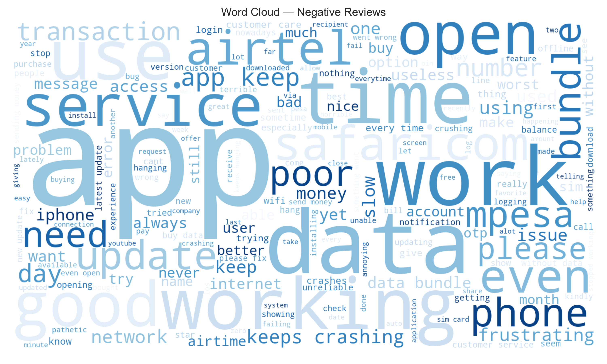
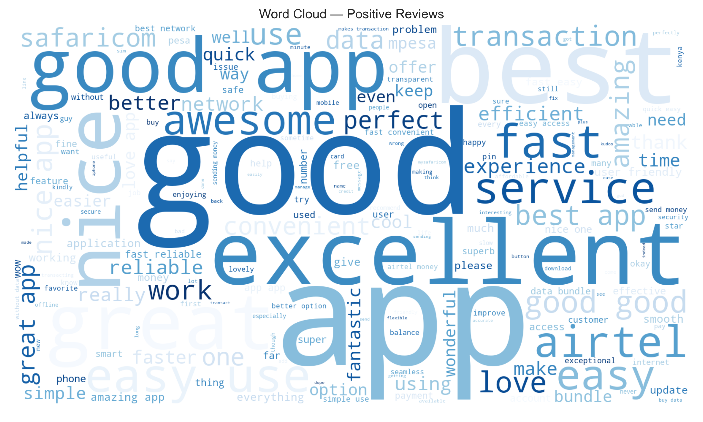

# Customer Sentiments For Safaricom and Airtel Analysis
# 📱 Kenya Telco App Reviews – Capstone Project
Authors: Jedidah Kathure, Winnie Amoit, Antony Njoroge  , Rachel Odhiambo, Ann Mumbe and Navros Kamau

[](https://www.python.org/)  
[]()  
[](LICENSE)  

### Customer Sentiment & Complaint Analysis from Google Play and App Store Reviews  
Comparing **Safaricom** and **Airtel** mobile apps using Natural Language Processing (NLP).

---

## 📌 Business Understanding
Kenya’s telecom giants, **Safaricom** and **Airtel**, serve millions who rely on their apps for mobile money, airtime, data bundles, and customer self-service.  

App-store reviews provide **authentic, unfiltered customer feedback** on issues such as:
- Network reliability  
- Data bundles  
- M-Pesa / Airtel Money  
- Login & OTP problems  
- App usability  

By applying **NLP techniques**, we can uncover patterns, detect problems, and deliver actionable insights to enhance customer experience.

**Impact:**  
✅ Detect outages & major complaints in near real-time  
✅ Support product/feature decisions  
✅ Reduce churn through better CX  
✅ Strengthen brand loyalty  

### 👥 Stakeholders
- **Executives / Business Leaders** → Align product strategy with customer needs.  
- **Product Managers** → Prioritize features and bug fixes based on real user feedback.  
- **Customer Experience (CX) Teams** → Detect pain points early and improve retention.  
- **Marketing Teams** → Monitor brand perception and sentiment shifts.  
- **Data Science & Engineering Teams** → Build scalable monitoring and analytics pipelines.  
- **Regulators & Industry Analysts** → Understand telco market competitiveness.  

---

### 💡 Business Value
- **Customer Retention** → Reduce churn by addressing common pain points.  
- **Operational Efficiency** → Detect service outages or app issues in near real-time.  
- **Strategic Decision-Making** → Data-driven insights for bundles, pricing, and service design.  
- **Brand Loyalty & Trust** → Transparent use of customer feedback to improve services.  
- **Competitive Benchmarking** → Compare Safaricom vs Airtel performance and sentiment trends. 

## 🎯 Objectives
1. **Sentiment Classification** → Positive, Negative, Neutral  
2. **Theme & Topic Mining** → Identify major complaint categories  
3. **Trend Analysis** → Monitor issues over time  
4. **Benchmarking** → Compare Safaricom vs Airtel customer satisfaction  

---

## 📂 Project Workflow
1. **Data Collection** – Scraping reviews from Google Play & App Store  
2. **Preprocessing** – Cleaning, tokenization, lemmatization  
3. **Exploratory Data Analysis (EDA)** – Word clouds, sentiment trends  
4. **Modeling** –  
   - Baseline ML models (Logistic Regression, Naive Bayes, SVM)  
   - Transformer models (BERT & variants)  
5. **Evaluation** – Accuracy, Precision, Recall, F1-score  
6. **Visualization & Insights** – Complaint categories, comparison dashboards  

---

## 🛠️ Tech Stack
- **Languages:** Python  
- **Libraries:** Pandas, NumPy, Scikit-learn, NLTK, SpaCy, Matplotlib, Seaborn, WordCloud, HuggingFace Transformers  

- **Data Sources:** Google Play Store, Apple App Store  

## 📊 Exploratory Data Analysis (EDA)

### Word Clouds
Visualizing the most frequent words in customer reviews:

**Safaricom**


**Airtel**


---

### Sentiment Distribution
Distribution of positive, neutral, and negative reviews:  


Distribution of positive, neutral, and negative reviews:  

---

### Trends Over Time
How customer sentiment evolved month-to-month:  


## 📈 Model Performance

### 🔹 Baseline Models (Traditional ML)
We first trained classical ML models using **TF-IDF features**:  

| Model                 | Accuracy | Macro F1 | Notes |
|------------------------|----------|----------|-------|
| Logistic Regression    | 86%      | 0.49     | Strong precision for positive, struggled with neutral detection |
| Naive Bayes            | 82%      | 0.42     | Faster but less balanced |
| Random Forest          | 84%      | 0.45     | Captured non-linearities but prone to overfitting |
| SVM (LinearSVC)        | 85%      | 0.47     | Competitive baseline |

---

### 🔹 Deep Learning (BERT-based)
Using a pre-trained **BERT transformer**, fine-tuned on app reviews:

| Metric     | Value |
|------------|-------|
| Accuracy   | 92%   |
| Macro F1   | 0.78  |
| Weighted F1| 0.91  |

✅ **Improvement over ML baselines**: Better handling of nuanced neutral reviews and more robust across all sentiment classes.  

---
### 📊 Visual Results

#### Confusion Matrices
Baseline Logistic Regression vs. BERT:  

  
  

#### Classification Report 
  

---

### 📊 Key Insights
- **Positive reviews** dominate both Safaricom & Airtel apps.  
- **Neutral reviews** were the hardest to classify — BERT improved detection significantly.  
- **Safaricom** had more complaints around *M-Pesa reliability* while **Airtel** issues leaned towards *login & OTP failures*.  

---
# Recomendations


## 🤖 Final Model Selection


## ⚙️ Setup Instructions
Clone the repository and set up a virtual environment:

```bash
git clone https://github.com/your-username/safaricom-airtel-analysis.git
cd safaricom-airtel-analysis

## Create and activate venv
python -m venv venv
source venv/bin/activate  # On Windows: venv\Scripts\activate

## Install dependencies
pip install -r requirements.txt

# Launch notebook
jupyter notebook safaricom_airtel_analysis.ipynb

# Interactive Tableau Dashboard

# File Structure


# Acknowledgements


# Questions?
Feel free to reach out or submit issues in this repo!
