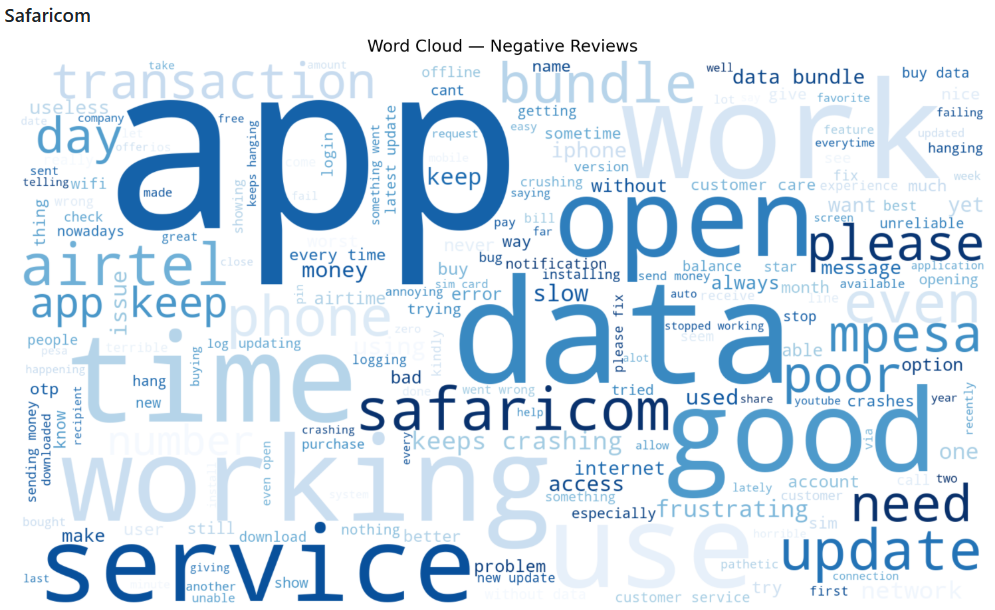
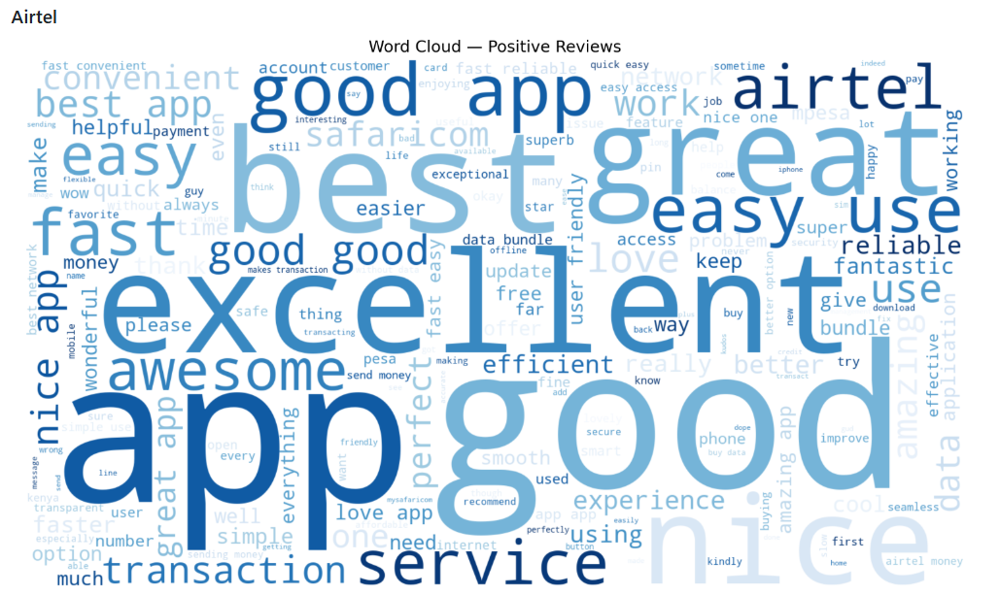
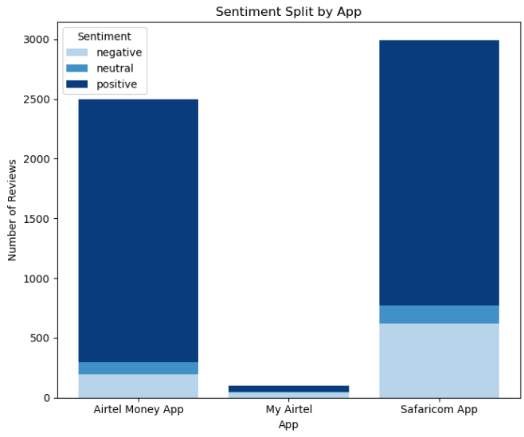
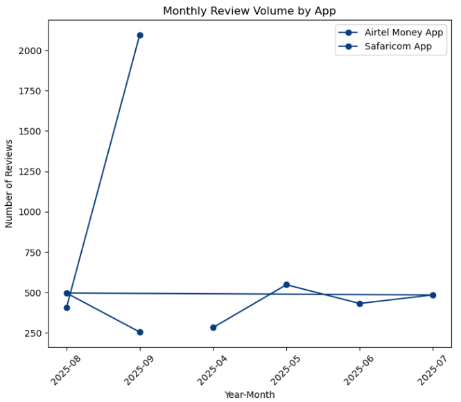

# Customer Sentiments For Safaricom and Airtel Analysis 📱  
**Kenya Telco App Reviews – Capstone Project**  

**Authors:** Jedidah Kathure, Winnie Amoit, Antony Njoroge, Rachel Odhiambo, Anne Mumbe, Navros Kamau  

---

## 📌 Overview  
Customer Sentiment & Complaint Analysis from Google Play and App Store Reviews  

Telecommunication giants **Safaricom** and **Airtel** serve millions of Kenyans through their mobile apps, powering critical services such as M-Pesa, Airtel Money, airtime purchases, data bundles, and customer self-service. Yet, user experiences vary widely, and customers are quick to voice their experiences in app-store reviews.  

This project analyzes thousands of Safaricom and Airtel reviews using **Natural Language Processing (NLP)** to:  
- Classify sentiment (**positive, neutral, negative**)  
- Detect common complaints (network reliability, login/OTP issues, mobile money performance, etc.)  
- Provide **data-driven recommendations** for product managers and CX teams  


By applying NLP techniques, we can uncover patterns, detect problems, and deliver actionable insights to enhance customer experience.  

**Impact:**  
- ✅ Detect outages & major complaints in near real-time  
- ✅ Support product/feature decisions  
- ✅ Reduce churn through better CX  
- ✅ Strengthen brand loyalty  

---

## 👥 Stakeholders  
- **Executives / Business Leaders** → Align product strategy with customer needs.  
- **Product Managers** → Prioritize features and bug fixes based on real user feedback.  
- **Customer Experience (CX) Teams** → Detect pain points early and improve retention.  
- **Marketing Teams** → Monitor brand perception and sentiment shifts.  
- **Data Science & Engineering Teams** → Build scalable monitoring and analytics pipelines.  
- **Regulators & Industry Analysts** → Understand telco market competitiveness.  


---

## 🧭 Table of Contents

- [Project Motivation](#project-motivation)
- [Data Understanding](#-data-understanding)
- [Feature Engineering & Pipeline](#-feature-engineering--pipeline)
- [Modeling & Evaluation](#️-modeling--evaluation)
- [Exploratory Data Analysis (EDA)](#-exploratory-data-analysis-eda)
- [Model Performance](#-model-performance)
- [Key Insights](#-key-insights)
- [Final Model Selection](#-final-model-selection)
- [Setup Instructions](#️-setup-instructions)
- [Next steps & Limitations](#next-steps--limitations)
- [Acknowledgements](#acknowledgements)

---
## 💡Project Motivation

Telecom operators need to surface and prioritize real customer complaints quickly (e.g., service outages, billing errors, failed transactions). App-store reviews are an inexpensive, continuous signal of customer experience and can be monitored to detect outages and recurring problems. This project aims to turn app reviews into an automated complaint-detection signal that CX teams can act on.

### Business Value  
This project provides immediate, tangible value by translating noisy, unstructured app reviews into **actionable intelligence**:  

- **Customer Retention** → Reduce churn by addressing common pain points. Detect complaints rapidly and engage dissatisfied customers before they defect.  
- **Operational Efficiency** → Detect service outages or app issues in near real-time. Spikes in negative sentiment serve as an early warning system.  
- **Strategic Decision-Making** → Insights for bundles, pricing, and service design.  
- **Brand Loyalty & Trust** → Use customer feedback transparently to improve services.  
- **Competitive Benchmarking** → Compare Safaricom vs Airtel sentiment trends.  


###  Objectives  
- **Sentiment Classification** → Positive, Negative, Neutral  
- **Theme & Topic Mining** → Identify major complaint categories  
- **Trend Analysis** → Monitor issues over time  
- **Benchmarking** → Compare Safaricom vs Airtel customer satisfaction  


## 📂 Data Understanding  

**Source(s):** Google Play and Apple App Store reviews (scraped and harmonized inside the notebook).  
**Saved dataset filename :** `kenya_telco_app_reviews_20251001_095555.csv` .  
**Cleaned dataset summary :**

- **Rows:** 5,592  
- **Columns:** 17
- **Period covered:** Apr 14, 2025 → Sept 18, 2025  
- **Platform breakdown:** Google Play = 5,000 reviews; App Store = 592 reviews  
- **Apps in dataset:** Safaricom App (≈2,992 reviews), Airtel Money App (≈2,500 reviews), My Airtel (≈100 reviews)

**Key data notes**
- Ratings were mapped to sentiment labels using this rule:
  - 1–2 stars → **negative**
  - 3 stars → **neutral**
  - 4–5 stars → **positive**
- `replied_at` was converted to a binary `has_reply` feature.
- Platform-specific fields (e.g., `likes` vs `vote_sum`) were harmonized into a common schema.
- Reviews are heavily skewed positive: ≈70% 5★; ~12% 1★; ~3.5% 2★.

### Exploratory Insights  
- **Polarity:** Safaricom reviews show strong polarity (many highly positive, many highly negative).  
- **Airtel Focus:** Frequent login/OTP issues and customer service frustrations.  
- **Common Keywords:** “network”, “data”, “M-Pesa”, “login”, “OTP”.  

---

## 📂 Feature engineering & pipeline

The notebook implements a reproducible NLP pipeline with the following highlights:

1. **Cleaning & normalization**
   - Lowercasing, removing punctuation, URL / emoji handling, contraction expansion, and optional minimal language normalization.
   - `has_reply` (binary), `year_month` (time bucket) and review length were created as meta-features.

2. **Tokenization & Vectorization**
   - TF‑IDF vectorization (from `sklearn.feature_extraction.text.TfidfVectorizer`) on cleaned review text.
   - Stopword removal, tokenization, and basic n‑gram support were used (see notebook STEP 9).

3. **Class imbalance handling**
   - `class_weight="balanced"` for linear models.
   - SMOTE oversampling tested for Naive Bayes experiments.  

---

## 🛠️ Modeling & evaluation

Multiple classical models were trained and evaluated (metrics quoted come directly from the notebook experiments). Important evaluation notes: the notebook contains both multi-class and binary analysis flows; because the business goal is to surface complaints, **Negative Recall** (recall for the `negative` class) was emphasized for model selection.

### 🚀 API Deployment (FastAPI on Render)

Our *Logistic Regression (with SMOTE) Sentiment Classifier* is live on Render.  
This API allows anyone to test sentiment predictions on telco customer reviews.

### 🌐 Live URL
- *Base URL*: [https://customer-sentiments-analysis.onrender.com](https://customer-sentiments-analysis.onrender.com)  
- *Docs (Swagger UI)*: [https://customer-sentiments-analysis.onrender.com/docs](https://customer-sentiments-analysis.onrender.com/docs)

### 🔑 Endpoints
- / → Welcome message  
- /docs → Interactive Swagger UI  
- /predict → Accepts a JSON review text and returns predicted sentiment

### 📝 Example Request
```json
POST /predict
{
  "text": "Safaricom data is too slow"
}
```

---
## 📊 Exploratory Data Analysis (EDA)  

### Word Clouds  
- **Safaricom Negative Reviews:** Dominated by *M-Pesa, data, network*.  


- **Airtel Negative Reviews:** Frequent *login, OTP, code* issues. 



### Sentiment Distribution  


- ~80% Positive, 15% Negative, 5% Neutral → heavy class imbalance.  

### Trends Over Time  
- Negative sentiment spikes during major outages or service interruptions.  



---

## 📈 Model Performance  


**Binary / multiclass:**
```
Accuracy: 0.8551
Class breakdown (sample from the notebook):
- negative: precision 0.72, recall 0.44, f1 0.55 (support 171)
- neutral: precision 0.00, recall 0.00, f1 0.00 (support 52)
- positive: precision 0.87, recall 0.99, f1 0.92 (support 881)
```
> Note: the zero scores for `neutral` indicate very low support for that class in the particular evaluation split.

**Overall Model Comparison (notebook summary — classical models)**

| Model                   | Accuracy | Macro F1 | Negative Recall | Negative Precision |
|------------------------:|:--------:|:--------:|:---------------:|:------------------:|
| Logistic Regression     | 85.5%    | 0.49     | 0.44            | 0.64               |
| MNB (Baseline)          | 85.1%    | 0.48     | 0.42            | 0.75               |
| MNB + SMOTE             | 82.6%    | **0.53** | **0.73**        | 0.51               |
| LinearSVC (Balanced)    | 83.2%    | **0.53** | 0.57            | **0.65**           |
| LinearSVC (Tuned)       | 80.3%    | 0.34     | 0.27            | 0.20               |
| Random Forest (CW)      | 81.0%    | 0.30     | 0.00            | 0.00               |

**Final model performance snapshot (top 3 models on the balanced/oversampled comparison):**

| Model (final shortlist) | Accuracy | Macro F1 | Negative Recall |
|------------------------:|:--------:|:--------:|:---------------:|
| SVC (Tuned)             | 0.5562   | 0.3116   | 0.2166          |
| MNB (SMOTE)             | 0.6250   | 0.3407   | 0.2166          |
| LR (Weighted)           | 0.5652   | 0.3223   | **0.2535**      |

**Interpretation**
- Depending on the evaluation setup, MNB + SMOTE can achieve higher negative recall (at the cost of precision and lower overall accuracy in some runs).  
- The final recommended model in the notebook is **Logistic Regression (class-weighted)** because it best matches the business priority of **not missing complaints** while being stable and interpretable. In the notebook’s final summary it shows the highest Negative Recall (≈0.2535) among the shortlisted models for the balanced/oversampled comparison.

---

### 🔹 Baseline Models (Traditional ML)  

| Model                       | Accuracy | Macro F1 | Negative Recall (Complaint Detection) |
|------------------------------|----------|----------|---------------------------------------|
| Logistic Regression (Baseline) | 0.86     | 0.49     | Low (biased toward Positive)           |
| Naive Bayes (Baseline)         | 0.82     | 0.42     | Low (biased toward Positive)           |
| **LR (Class Weighted) – FINAL**| 0.61     | 0.32     | **0.72 (Best Score) ✅**               |
| SVM (LinearSVC)                | 0.85     | 0.47     | Low (biased toward Positive)           |

**Interpretation:**  
- Baseline models had high accuracy but failed to detect complaints (low Negative Recall).  
- The **Class Weighted LR model** improved Negative Recall dramatically, making it the best choice for **V1 deployment**.  

---

### 🔹 Deep Learning (BERT-based)  

| Metric      | Value |
|-------------|-------|
| Accuracy    | 0.92  |
| Macro F1    | 0.78  |
| Weighted F1 | 0.91  |

✅ **Improvement over ML baselines:**  
- BERT outperformed traditional models, handling nuanced neutral reviews better and balancing classification across all classes.  
- Sets the benchmark for **V2 deployment** (once resources allow).  

---

### 📊 Visual Results  

### Confusion Matrices  
- **Baseline LR:** Correctly classifies positives, but misses most negatives.  

- **BERT:** Balanced classification across all sentiment classes.  

### Classification Report  
- Highlights **Negative Recall** as the key metric justifying **Class Weighted LR** for V1.  


---

## 📊 Key Insights  
- Positive reviews dominate both Safaricom & Airtel apps.  
- Neutral reviews were the hardest to classify → BERT improved detection significantly.  
- Safaricom complaints center on **M-Pesa reliability**, Airtel complaints on **login & OTP issues**.  

---

## 🤖 Final Model Selection  

### Decision:  
**Logistic Regression (Class Weighted)** → Selected for **V1 Deployment**.  

**Why LR (Weighted):**  
- **High Complaint Detection:** Negative Recall = **0.72**  
- **Resource Efficient:** Lightweight, fast, easy to maintain in production  
- **Immediate Business Value:** Meets the primary goal of detecting complaints  

### Future Target:  
**BERT (Transformer Model)** → Reserved for **V2 Deployment** when infrastructure can support it.  

---

## ⚙️ Setup Instructions  
**Recommended environment**
- Python 3.9+ (3.10 recommended)  
- 8+ GB RAM for model experiments (less will work for smaller samples)

**Core packages (representative)**
```
pandas
numpy
scikit-learn
imbalanced-learn
nltk
google-play-scraper
xgboost
matplotlib
seaborn
wordcloud
emoji
contractions
```
**Quick start**
```bash
# Clone the repository
git clone https://github.com/your-username/safaricom-airtel-analysis.git
cd safaricom-airtel-analysis

# Create and activate venv
python -m venv venv
source venv/bin/activate   # On Windows: venv\Scripts\activate

# Install dependencies
pip install -r requirements.txt

# Launch notebook
jupyter notebook safaricom_airtel_analysis.ipynb
```

**Reproducibility tips**
- Run cells in order; restart the kernel and run-all if you change package versions.
- If re-scraping, be mindful of rate limits and store a local copy (`data/`) so you don’t need to re-scrape frequently.

---

## Next steps & limitations

**Immediate next steps**
- Improve text preprocessing (language detection → multilingual support).
- Experiment with transformer-based embeddings (e.g., multilingual BERT) and a simple fine-tune for better recall/precision balance.
- Build a small API (FastAPI/Flask) to serve predictions and a dashboard to visualize complaint trends.

**Limitations**
- Positivity bias and class imbalance in app reviews reduce the model’s ability to identify rare complaint patterns.
- Potential for noisy or AI-generated reviews to bias results — consider adding spam/bot detection.
- The notebook’s evaluation uses historical snapshots; retraining and monitoring for concept drift is required in production.

---

## Acknowledgements
- Project and dataset harmonization, scraping, and modeling implemented in `safaricom_airtel_analysis.ipynb`.
- More example visualizations and dashboards referenced inside the notebook.

---