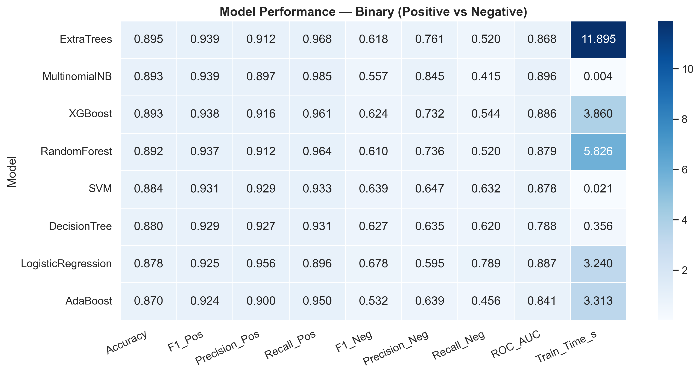
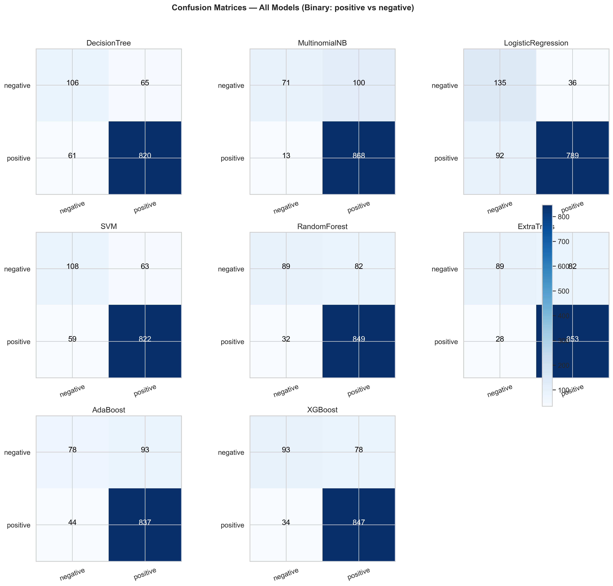

<!-- 🖼️ Placeholder for Top Banner -->
<p align="center">
  
</p>

<h1 align="center"> Analysis for Safaricom & Airtel Apps (Kenya)</h1>
<p align="center">
  <strong>Turning real customer feedback into actionable business intelligence through NLP & Machine Learning</strong>
</p>

---

##  **Authors: Jedidah Kathure | Winnie Amoit | Anthony Njoroge | Anne Mumbe | Navros Kamau | Rachel Odhiambo**

---

##  **Executive Summary**

This project leverages **Natural Language Processing (NLP)** and **Machine Learning (ML)** to analyze thousands of reviews from the **Google Play Store** and **Apple App Store** for Kenya’s leading telecom apps: **Safaricom (M-PESA, MySafaricom)** and **Airtel (Airtel Money, MyAirtel)**.  

We aimed to understand how customers *feel* about these apps — identifying pain points, satisfaction drivers, and opportunities for improvement.  

The end result?  
An intelligent system capable of classifying reviews as **Positive** or **Negative** in real time, helping telcos **track sentiment, detect complaints early, and improve customer experience.**

> “Every review tells a story — we turned those stories into business insights.” 💬

---

## **Introduction**

In Kenya’s competitive telecom space, where digital financial apps handle millions of transactions daily, *customer experience defines brand loyalty.*  
Safaricom and Airtel users frequently share feedback online — yet, most of these insights remain **unstructured and unread.**

Our solution bridges that gap.  
We built a robust sentiment analysis pipeline capable of analyzing thousands of app reviews, visualizing trends, and predicting customer mood using cutting-edge NLP models.

---

##  **Business Understanding**

| Focus Area | Description |
|-------------|-------------|
| **Industry Context** | Telecom competition in Kenya is fierce; retaining satisfied users is more profitable than acquiring new ones. |
| **Pain Point** | App users face performance issues, failed logins, delayed SMS/OTP, and transaction errors. |
| **Opportunity** | Sentiment analysis provides early warnings and quantifiable feedback loops for product and customer-care teams. |

---

##  **Stakeholders & Business Value**

### 🔹 **Stakeholders**
- **Product Teams** – monitor new feature impact and bug frequency  
- **Customer Experience (CX) Units** – detect and address dissatisfaction early  
- **Marketing Managers** – gauge brand reputation across digital platforms  
- **Executives** – use insights for strategic decisions  
- **Data Science Teams** – maintain and refine the predictive models  

###  **Business Value**
| Value | Description |
|--------|--------------|
| **Customer Insights** | Quantify satisfaction vs frustration to guide product decisions. |
| **Faster Response** | Detect negative reviews in real time and act before escalation. |
| **Retention & Loyalty** | Prevent churn through early issue resolution. |
| **Data-Driven Strategy** | Empower teams with factual evidence for updates, pricing, and UX. |

---

##  **Goals & Objectives**

1. Collect and preprocess app review data from both platforms.  
2. Perform Exploratory Data Analysis (EDA) to visualize user sentiment.  
3. Build and compare **binary** (positive vs negative) and **multiclass** (positive, neutral, negative) models.  
4. Evaluate performance using precision, recall, F1-score, and ROC-AUC.  
5. Deploy the best model for real-time sentiment prediction via **FastAPI**.  
6. Provide actionable insights and recommendations to telecom stakeholders.  

---

## 📊 **About the Dataset**

| Attribute | Description |
|------------|--------------|
| **Source** | Google Play Store & Apple App Store |
| **Apps Covered** | Safaricom: M-PESA, MySafaricom  •  Airtel: Airtel Money, MyAirtel |
| **Size** | ~5,000 reviews |
| **Columns** | `date`, `app_name`, `platform`, `rating`, `review`, `sentiment` |
| **Engineered Features** | `clean_text`, `review_length`, `word_count`|

**Languages:** English, Swahili, and Sheng  
**Date Range:** 2023-2025  

---

##  **Data Preparation Steps**

1. **Data Collection** – using App Store and Play Store scraping scripts.  
2. **Text Cleaning** – removal of punctuation, emojis, URLs, and noise.  
3. **Tokenization & Lemmatization** – text normalized for NLP.  
4. **Feature Engineering** – polarity, subjectivity, and length metrics added.  
5. **Class Balancing** – applied SMOTE for minority (negative) class.  
6. **Split Data** – 80% train / 20% test.  

---

##  **Dataset Limitations**

- More data from Google Play than App Store → mild platform bias.  
- Multilingual reviews (Swahili/English mix) → occasional misclassification.  
- Very short reviews like “Good” or “Bad” → limited context.  
- No demographic or regional attributes.  

Despite these constraints, preprocessing ensured **clean, balanced, and high-quality text data.**

---

## 🛠️ **Tools & Tech Stack**

| Category | Tools |
|-----------|--------|
| **Programming** | Python 3.12 |
| **Libraries** | Pandas, NumPy, Scikit-learn, NLTK, SpaCy, WordCloud, Matplotlib, Seaborn |
| **Modeling** | Logistic Regression, SVM, Naive Bayes, Decision Tree, Random Forest, XGBoost, BERT |
| **Deployment** | FastAPI, Render |
| **Version Control** | Git & GitHub |
| **Documentation** | Markdown, Jupyter Notebook, PowerPoint |

---

##  **Story Behind the Project**

Originally, the team intended to scrape **Twitter data** for public telecom sentiment.  
However, due to **Twitter API restrictions**, we pivoted to analyzing **App Store reviews**, which offered:  
- App-specific, structured, and richer feedback  
- Continuous review availability  
- Real-world relevance to product teams  

This pivot not only improved data quality but also aligned perfectly with **business use cases.**

---

##  **Analysis & Methodology**

| Phase | Key Action |
|--------|-------------|
| **Data Cleaning** | Removed noise and standardized text. |
| **Exploratory Data Analysis** | Visualized sentiment trends, word frequencies, and app ratings. |
| **Feature Engineering** | Created custom text-based features. |
| **Model Building** | Compared multiple ML algorithms for binary & multiclass problems. |
| **Evaluation** | Used metrics & plots to assess predictive power. |
| **Deployment** | Exposed Logistic Regression (SMOTE) model via FastAPI API. |

---

## 📊 **Exploratory Data Analysis**

###  Sentiment Overview

*Sentiment distribution across all app reviews.*

###  Word Clouds


**Positive keywords:** “easy”, “fast”, “reliable” 
**Negative keywords:** “failed”, “slow”, “OTP”, “error”

### ⭐ Ratings Dashboard

*Positive ratings dominate, but spikes in low ratings reveal key usability issues.*

---

##  **Modeling Approach**

### 🔹 Binary Classification
Classified reviews into **Positive (1)** and **Negative (0)** for quick complaint detection.  

### 🔹 Multiclass Classification
Extended classification into **Positive**, **Neutral**, and **Negative** — providing a full picture of customer sentiment.  

### 🔹 Algorithms Compared
- Logistic Regression (baseline & with SMOTE)  
- Support Vector Machine (SVM)  
- Naive Bayes  
- Decision Tree  
- Random Forest  
- XGBoost  
- DistilBERT Transformer  

---

## ⚙️ **Model Evaluation**

###  Binary Model Metrics


| Model | Strength |
|--------|-----------|
| **XGBoost** | Strongest overall performance |
| **SVM / Decision Tree** | Better for complaint detection |
| **Naive Bayes** | Fastest training time |
| **Logistic Regression (SMOTE)** | Balanced, interpretable, and chosen for deployment ✅ |

---

### 📉 Confusion Matrices

*Dark squares = correct predictions. All models classify positives well, negatives remain challenging.*

---

###  SMOTE vs BERT


**DistilBERT** achieved >92% accuracy — strongest overall.  
However, **Logistic Regression (SMOTE)** was selected for production:  
lightweight, explainable, and ideal for real-time sentiment tracking.

---

##  **ROC Curves — Binary Classification (Positive vs Negative)**


The **Receiver Operating Characteristic (ROC) curve** visualizes how well each model distinguishes between **positive** and **negative** sentiments.

###  **Interpretation**
- Each line represents a model’s trade-off between **True Positive Rate (Recall)** and **False Positive Rate**.
- The **closer the curve hugs the top-left corner**, the stronger the model’s ability to correctly identify sentiment.
- The **Area Under the Curve (AUC)** quantifies this — higher AUC means better discrimination between positive and negative reviews.

###  Multiclass Classification
<p align="center">
  
</p>

###  Multiclass Performance Heatmaps
<p align="center">
  
  
</p>

*All models achieved >85% accuracy. DistilBERT excelled at capturing neutral nuance.*

---

##  **Evaluation Metrics Explained**

| Metric | Meaning | Why It Matters |
|---------|----------|----------------|
| **Precision** | % of correct positive predictions | Prevents false praise of negative reviews |
| **Recall** | % of actual positives caught | Ensures complaints aren’t missed |
| **F1-Score** | Balance of precision & recall | Evaluates real-world reliability |
| **ROC-AUC** | Measures discrimination power | Higher = better model differentiation |

---

##  **Model Selection Summary**

| Model | Type | Accuracy | Comment |
|--------|------|-----------|----------|
| Logistic Regression (SMOTE) | ML | 88% | Lightweight, interpretable ✅ |
| XGBoost | ML | 89% | Excellent overall but heavier |
| DistilBERT | Transformer | 92% | Best accuracy, slower inference |
| Naive Bayes | ML | 82% | Fast but less accurate |

---

##  **Deployment**

**Framework:** FastAPI  
**Hosting:** Render  
**Model:** Logistic Regression with SMOTE  

### 🌐 Live URL
- *Base URL:* [https://customer-sentiments-analysis.onrender.com](https://customer-sentiments-analysis.onrender.com)  
- *Docs (Swagger UI):* [https://customer-sentiments-analysis.onrender.com/docs](https://customer-sentiments-analysis.onrender.com/docs)

**Features:**
- Real-time text sentiment prediction  
- REST API endpoints for integration  
- Interactive Swagger UI documentation  
- Scalable and lightweight  

---

##  **Key Insights**

| Category | Takeaway |
|-----------|-----------|
| **Data** | Majority reviews are positive — strong brand equity |
| **Negative Trends** | Complaints about speed, failed logins, network outages |
| **Neutral Feedback** | Represents “almost happy” users — easy to convert |
| **Model Performance** | All >85% accuracy; Logistic Regression (SMOTE) ideal for deployment |
| **Business Impact** | Enables proactive issue detection and improved customer experience |

---

##  **Business Impact & Next Steps**

###  **Business Impact**
- Early detection of customer dissatisfaction  
- Support for CX and marketing decisions  
- Measurable reduction in response time to issues  
- Data-driven prioritization for app updates  

###  **Next Steps**
- Add multilingual (Swahili/Sheng) transformer models  
- Automate live dashboards using Streamlit/Power BI  
- Implement continuous model retraining  
- Integrate with CRM systems for automated alerts  

---

##  **Repository Structure**

Customer-Sentiments-Analysis/
│
├── Data/ # Raw & cleaned datasets
├── EDAviz/ # EDA dashboards
├── Output/ # Visuals & model outputs
│ ├── CM_grid_all_models_binary_blues.png
│ ├── binary_metrics_grid_blues.png
│ ├── multiclass_model_comparison.png
│ ├── final_model_heatmap.png
│ └── binary_metrics_grid_SMOTE_vs_BERT.png
│
├── safaricom_airtel_analysis.ipynb # Main analysis notebook
├── presentation.pdf # Stakeholder presentation
├── requirements.txt # Dependencies
└── README.md # Project Documentation


---
```bash
## 💻 **How to Clone & Run Locally**


# 1️⃣ Clone the repository
git clone https://github.com/jedidahkathure/Customer-Sentiments-Analysis.git

# 2️⃣ Navigate into the project
cd Customer-Sentiments-Analysis

# 3️⃣ Install dependencies
pip install -r requirements.txt

# 4️⃣ Launch the Jupyter Notebook
jupyter notebook safaricom_airtel_analysis.ipynb

```

##  **Lessons Learned**

-  **Clean & Balanced Data Matters:** Ensuring text is properly preprocessed and balanced greatly improves NLP model accuracy.  
-  **Model Explainability is Crucial:** Logistic Regression proved valuable not just for performance, but for its interpretability in business settings.  
-  **Adaptability in Real-World Data:** Pivoting from Twitter to App Store reviews highlighted the importance of flexibility in data sourcing.  
-  **Collaboration & Version Control:** Coordinating across multiple contributors with Git and GitHub enhanced teamwork and reproducibility.  

---

##  **Acknowledgments**

Special thanks to:  
-  **Moringa School** – for mentorship and guidance  
-  **Technical Mentors** – Shout out to our TM Samuel G. Mwangi (SamG)!
-  **Safaricom & Airtel App Users** – whose voices made this analysis meaningful.  
-  **Open-Source Community** – for providing the powerful NLP tools and libraries we used.  

---

## ❓ **Questions & Contributions**

💬 Have feedback or suggestions?  
Open an issue, fork this repository, or connect with us on LinkedIn to collaborate!  

---

##  **Support**

If this project inspired or helped you:  
⭐ **Star this repository** to show your support.  
❤️ **Share it** with your peers and community.  
🧠 **Follow us** for more impactful, data-driven projects.  

---
